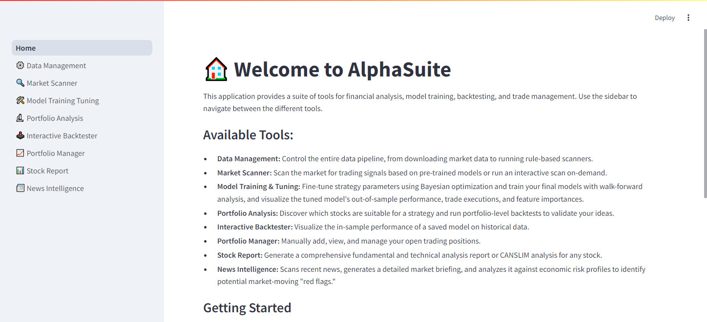
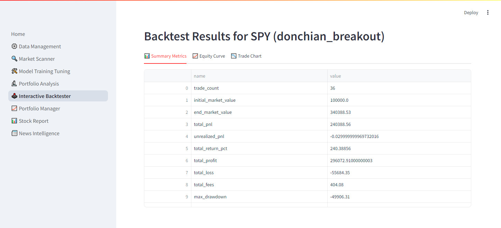
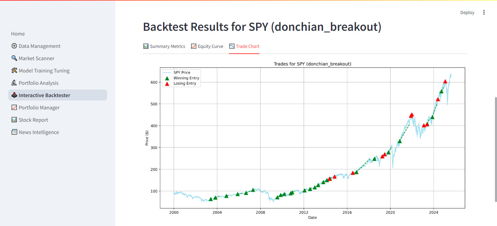
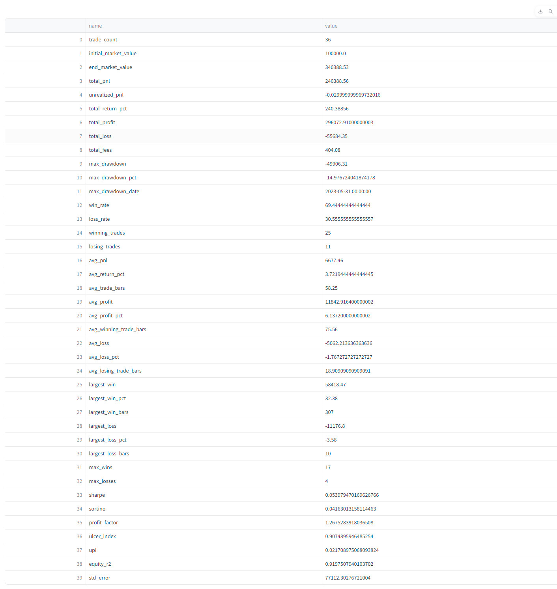

# AlphaSuite

AlphaSuite is a comprehensive suite of tools for quantitative financial analysis, model training, backtesting, and trade management. It's designed for traders and analysts who want to build, validate, and deploy data-driven trading strategies.

## 🌐 Live Demo

**Check out the live application here: [https://alphasuite.aitransformer.net](https://alphasuite.aitransformer.net)**

> **Note:** The live demo runs on a free-tier service. To prevent high costs and long loading times, data loading and AI-powered features are disabled. For full functionality and the best performance, it's recommended to run the application locally.

## ✨ Key Features

*   **Strategy Development & Backtesting**:
    *   **Model Training & Tuning**: Fine-tune strategy parameters using Bayesian optimization and train final models with walk-forward analysis.
    *   **Performance Visualization**: Visualize a tuned model's out-of-sample performance, trade executions, and feature importances.
    *   **Portfolio Analysis**: Discover which stocks are suitable for a strategy and run portfolio-level backtests to validate your ideas.
    *   **Interactive Backtester**: Visualize the in-sample performance of a saved model on historical data.
*   **Live Analysis & Trading**:
    *   **Market Scanner**: Scan the market for trading signals based on pre-trained models or run an interactive scan on-demand.
    *   **Portfolio Manager**: Manually add, view, and manage your open trading positions.
*   **Data & Research**:
    *   **Data Management**: Control the entire data pipeline, from downloading market data to running rule-based scanners.
    *   **AI-Powered Stock Reports**: Generate a comprehensive fundamental and technical analysis report or CANSLIM analysis for any stock.
    *   **News Intelligence**: Scans recent news, generates a detailed market briefing, and analyzes it against economic risk profiles.
*   **Robust Data Pipeline**: Fetches and stores comprehensive company data, price history, financials, and analyst estimates from Yahoo Finance into a PostgreSQL database.
*   **Interactive Web UI**: A Streamlit-based dashboard for managing data, training models, and analyzing results.

## 🖼️ Screenshots

Here's a glimpse of what you can do with AlphaSuite.

### Home Page


### Backtest Performance Visualization

Analyze the out-of-sample performance of a trained and tuned strategy model.

**Summary Metrics & Equity Curve:**



**Trade Execution Chart:**


**Detailed Metrics Table:**


## 🛠️ Tech Stack

*   **Backend**: Python
*   **Web Framework**: Streamlit
*   **Data Analysis**: Pandas, NumPy, SciPy, PyBroker
*   **Financial Data**: yfinance, TA-Lib
*   **Database**: PostgreSQL with SQLAlchemy
*   **AI/LLM**: LangChain, Google Gemini, Ollama

## 📂 Project Structure

The project is organized into several key directories:

*   `core/`: Contains the core application logic, including database setup (`db.py`), model definitions (`model.py`), and logging configuration.
*   `pages/`: Each file in this directory corresponds to a page in the Streamlit web UI.
*   `pybroker_trainer/`: Holds the machine learning pipeline for training and tuning trading models with `pybroker`.
*   `strategies/`: Contains the definitions for different trading strategies. New strategies can be added here.
*   `tools/`: Includes various utility modules for tasks like financial calculations, data scanning, and interacting with the `yfinance` API.
*   `Home.py`: The main entry point for the Streamlit application.
*   `download_data.py`: The command-line interface for all data management tasks.
*   `quant_engine.py`: The core quantitative engine for backtesting and analysis.
*   `requirements.txt`: A list of all the Python packages required to run the project.
*   `.env.example`: An example file for environment variables.

## 🚀 Getting Started

Follow these steps to set up and run AlphaSuite on your local machine.

### 1. Prerequisites

*   Python 3.9+
*   PostgreSQL Server
*   Git

### 2. Installation

1.  **Clone the repository:**
    ```bash
    git clone https://github.com/rsandx/AlphaSuite.git
    cd AlphaSuite
    ```

2.  **Create and activate a virtual environment:**
    ```bash
    # Windows
    python -m venv venv
    .\venv\Scripts\activate

    # macOS / Linux
    python3 -m venv venv
    source venv/bin/activate
    ```

3.  **Install dependencies:**
    *   **TA-Lib**: This library has a C dependency that must be installed first. Follow the official [TA-Lib installation instructions](https://github.com/mrjbq7/ta-lib) for your operating system.
    *   Install the remaining Python packages:
        ```bash
        pip install -r requirements.txt
        ```

4.  **Set up the Database:**
    *   Ensure your PostgreSQL server is running.
    *   Create a new database (e.g., `alphasuite`).
    *   You do not need to create tables manually. The application will handle this automatically.

5.  **Configure Environment Variables:**
    *   Copy the example environment file:

        ```bash
        cp .env.example .env
        ```
    *   Open the `.env` file and edit the variables:
        *   `DATABASE_URL`: Set this to your PostgreSQL connection string.
        *   `LLM_PROVIDER`: Set to `gemini` or `ollama` to choose your LLM provider.
        *   `DEMO_MODE`: Set to `true` to run in a read-only "demo" mode. This disables all data download and manipulation scripts, making it ideal for safely exploring the UI with the pre-loaded SPY data. Set to `false` for full functionality.
        *   `GEMINI_API_KEY`: Required if `LLM_PROVIDER` is `gemini`.
        *   `OLLAMA_URL`: The URL for your running Ollama instance (e.g., `http://localhost:11434`). Required for `ollama`.
        *   `OLLAMA_MODEL`: The name of the model you have pulled in Ollama (e.g., `llama3`).

### 3. Usage

1.  **Run the Streamlit Web Application:**
    To initialize the database and start the web server, run:
    ```bash
    streamlit run Home.py
    ```
    Open your web browser to the local URL provided by Streamlit (`http://localhost:8502`). The port is set in streamlit config.toml file.

    On the very first run, the application will automatically:
    1.  Create all necessary tables in your database.
    2.  Download baseline historical data for the **SPY** ticker.

    This ensures that you can start exploring the app's features immediately. If you prefer to initialize the database from the command line first, you can run:
    `python download_data.py init-db`

2.  **Downloading Additional Data (Optional):**
    After the baseline data is loaded, you can populate the database with more market data from the **Data Management** page in the web UI or by running the script from your terminal:
    ```bash
    # Download data for the US market
    python download_data.py download --market=us
    ```
    > **Note:** The `download_data.py` script is disabled if `DEMO_MODE` is set to `true` in your `.env` file.

3.  **Explore the App:**
    *   **Tune & Train:** To build custom models, navigate to the **Model Training & Tuning** page.
    *   **Scan for Signals:** Use the **Market Scanner** to find live trading signals based on pre-built rules or your own trained models.
    *   **Analyze & Backtest:** Use the **Portfolio Analysis** page to discover which stocks are suitable for a strategy and run portfolio-level backtests to validate your ideas.

## 🧠 Adding a New Trading Strategy

The quantitative engine is designed to be modular, allowing new trading strategies to be developed and integrated by simply adding a single, self-contained Python file to the `strategies/` directory. The system automatically discovers and loads any valid strategy file at runtime.

### How It Works

The system scans the `strategies/` directory for Python files. Inside each file, it looks for a class that inherits from `pybroker_trainer.strategy_sdk.BaseStrategy`. This class encapsulates all the logic and parameters for a single strategy.

### Step-by-Step Guide

1.  **Create a New File:** Create a new Python file in the `strategies/` directory. The filename should be descriptive and use snake_case (e.g., `my_awesome_strategy.py`).
2.  **Define the Strategy Class:** Inside the new file, define a class that inherits from `BaseStrategy`. The class name should be descriptive and use CamelCase (e.g., `MyAwesomeStrategy`).
3.  **Implement Required Methods:** Implement the four required methods within your class: `define_parameters`, `get_feature_list`, `add_strategy_specific_features`, and `get_setup_mask`.

### Strategy Class Breakdown

Each strategy class must implement the following methods, which define its behavior, data requirements, and entry logic.

#### 1. `define_parameters()`

This static method defines all the parameters the strategy uses, their default values, and their tuning ranges for optimization. This is critical for backtesting and hyperparameter tuning.

*   **Returns:** A dictionary where each key is a parameter name. The value is another dictionary specifying its `type`, `default` value, and a `tuning_range` tuple.

**Example from `DonchianBreakoutStrategy`:**
```python
@staticmethod
def define_parameters():
    """Defines parameters, their types, defaults, and tuning ranges."""
    return {
        'donchian_period': {'type': 'int', 'default': 20, 'tuning_range': (15, 50)},
        'atr_period': {'type': 'int', 'default': 14, 'tuning_range': (10, 30)},
        # ... other parameters
    }
```

#### 2. `get_feature_list()`

This method returns a list of all the feature (column) names that the strategy's machine learning model requires as input. The training engine uses this list to prepare the data correctly.

*   **Returns:** A `list` of strings.

**Example from `DonchianBreakoutStrategy`:**
```python
def get_feature_list(self) -> list[str]:
    """Returns the list of feature column names required by the model."""
    return [
        'roc', 'rsi', 'mom', 'ppo', 'cci',
        # ... other features
    ]
```

#### 3. `add_strategy_specific_features()`

This is where you calculate any indicators or features that are unique to your strategy and are not part of the common features provided by the system.

*   **Arguments:** A pandas `DataFrame` containing the price data and common indicators.
*   **Returns:** The modified pandas `DataFrame` with your new feature columns added.

**Example from `DonchianBreakoutStrategy`:**
```python
def add_strategy_specific_features(self, data: pd.DataFrame) -> pd.DataFrame:
    """Calculates and adds features unique to this specific strategy."""
    donchian_period = self.params.get('donchian_period', 20)
    data['donchian_upper'] = data['high'].rolling(window=donchian_period).max()
    data['donchian_lower'] = data['low'].rolling(window=donchian_period).min()
    data['donchian_middle'] = (data['donchian_upper'] + data['donchian_lower']) / 2
    return data
```

#### 4. `get_setup_mask()`

This is the core of your strategy's entry logic. This method must return a boolean pandas `Series` that is `True` on the bars where a potential trade setup occurs and `False` otherwise.

*   **Arguments:** A pandas `DataFrame` containing all required features (both common and strategy-specific).
*   **Returns:** A pandas `Series` of boolean values, with the same index as the input `DataFrame`.

**Example from `DonchianBreakoutStrategy`:**
```python
def get_setup_mask(self, data: pd.DataFrame) -> pd.Series:
    """Returns a boolean Series indicating the bars where a trade setup occurs."""
    is_uptrend = data['trend_bullish'] == 1
    is_breakout = data['high'] > data['donchian_upper'].shift(1)
    raw_setup_mask = is_uptrend & is_breakout
    # Ensure we only signal on the first bar of a new setup
    return raw_setup_mask & ~raw_setup_mask.shift(1).fillna(False)
```

By following this structure, you can create new, complex strategies that seamlessly integrate with the project's backtesting, tuning, and training infrastructure.

## ⚖️ License

This project is licensed under the MIT License - see the LICENSE file for details.